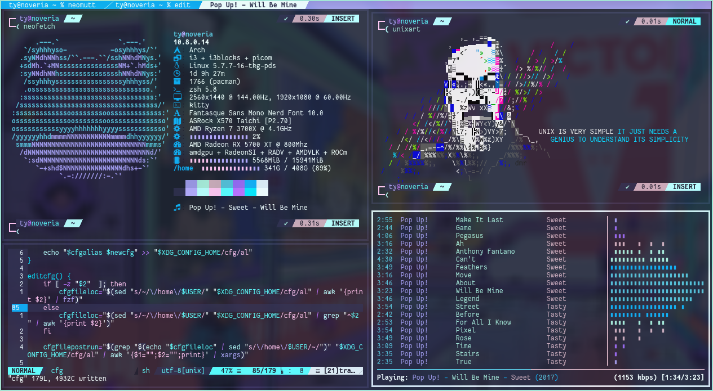

# My Dotfiles

*wpgtk templates are stored in .config/wpg/templates/*

## My Workflow
```sh 
[ "$(awk -F"=" '/^NAME/ {print $2}' /etc/os-release | sed 's|"||g')" = "Arch Linux" ]
```
* WM
: Xorg
    - i3-gaps w/ i3blocks and picom
: Wayland
    - sway w/ waybar
* $TERMINAL
: alacritty + nvim :terminal
* $SHELL
: zsh (zinit)
    - [zsh expandable aliases](.zshal)
    - [powerline10k prompt](.p10k.zsh)
* $BROWSER
: firefox
: qutebrowser
: brave
: ungoogled-chromium
    - tridactyl
    - ublock origin + umatrix
    - bukubrow
    - stylus
* $FILEMAN
: lf
* $EDITOR
: nvim (vim-plug)
    - coc.nvim
* MAIL READER
: neomutt
* MUSIC PLAYER
: mpd (ncmpcpp[tui] + mpc[cli])
* NOTIF DAEMON
: dunst
* MEDIA VIEWER
: mpv

## Bringing Vim-Like Modes to Your Own Setup
* Text Editor/IDE
: Neovim
* Terminal Multiplexer
: Neovim :terminal + tabs/windows functionality
* Window Manager
: Xorg - i3
: Wayland - sway
* Browser
: qutebrowser
: firefox (tridactyl)
: chromium (vimium)
* shell
: zsh (vi-mode)

## Some Usage Information
- wpg templates need to be symlinked upon cloning/pulling if the symlink isn't there already
