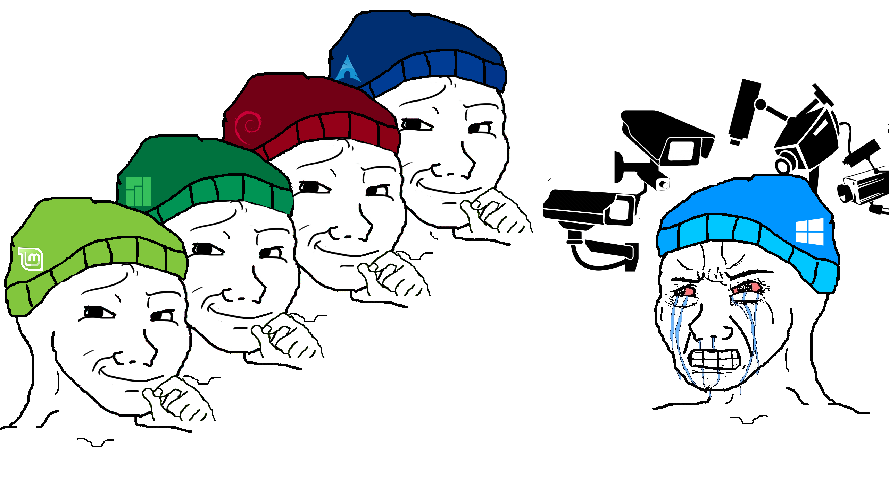

# My Dotfiles

*wpgtk templates are stored in .config/wpg/templates/*

# My Workflow
* OS - arch
* WM - i3-gaps w/ i3blocks and picom
* Terminal - kitty
* Shell - zsh
    - [zsh expandable aliases](.zshal)
    - powerline10k prompt
* Browser - firefox-nightly, qutebrowser, brave, ungoogled-chromium
    - tridactyl
    - bukubrow
    - ublock origin + umatrix
    - stylus
* File Manager - lf
* Editor - nvim
    - vim-plug
* Mail Reader - neomutt
* Music Player - mpd (ncmpcpp)
* Notification Daemon - dunst
* Media Viewer - mpv

